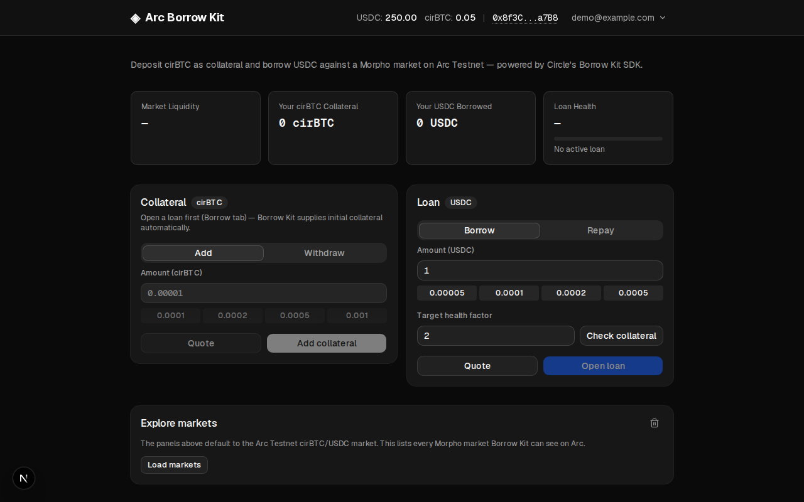

# Arc USDC Borrowing Sample App

This Next.js sample shows how to borrow **USDC** against **cirBTC** collateral on **Arc Testnet**.
It uses Circle's **Borrow Kit** to discover Morpho markets, request quotes, and manage loans.
Borrowing transactions use a Circle **User-Controlled Wallet**, with the wallet owner approving
each write operation through a PIN challenge in the browser.

The app includes Supabase email/password sign-in, wallet setup and reconnection, a dashboard for
the default cirBTC/USDC market, and an activity log of SDK responses. It is an end-to-end example
for developers exploring the borrowing flow on testnet.



## Table of Contents

- [Features](#features)
- [How It Works](#how-it-works)
- [Prerequisites](#prerequisites)
- [Getting Started](#getting-started)
- [Environment Variables](#environment-variables)
- [Available Scripts](#available-scripts)
- [Testing](#testing)
- [Security & Usage Model](#security--usage-model)
- [Legal](#legal)

## Features

A single dashboard (`/`) provides:

- **Account and wallet setup** — sign in with Supabase, then create or reconnect a PIN-secured
  Circle wallet.
- **Market and position details** — view the default cirBTC/USDC market, loan health factor,
  loan-to-value ratio, and liquidation price.
- **Loan actions** — check required collateral, get quotes, open a loan, borrow more USDC,
  repay, or close the loan.
- **Collateral actions** — add or withdraw cirBTC from an existing loan. A withdrawal may also
  repay USDC to keep the loan healthy.
- **Market explorer and activity log** — browse Morpho markets on Arc and inspect responses
  from Borrow Kit calls.

## How It Works

1. Sign up or sign in. The app links the Supabase user to a Circle User-Controlled Wallet; new
   users approve wallet setup through Circle's PIN widget.
2. Review the default cirBTC/USDC market and request a quote. For a new loan, Borrow Kit
   calculates the cirBTC collateral needed for the chosen USDC amount and target health factor.
3. Approve a borrow, repay, or collateral action through the wallet's PIN challenge. The server
   uses Borrow Kit and the Circle wallet adapter to submit the action.
4. Review the updated loan position and activity log. When withdrawing collateral, check the
   quote's maximum bundled USDC repayment before approving.

## Prerequisites

- **Node.js v22+** — Install via [nvm](https://github.com/nvm-sh/nvm)
- Circle User-Controlled Wallets **[API key](https://console.circle.com/signin)**
- A Circle **App ID**, issued alongside the API key, for the W3S PIN widget

## Getting Started

1. Clone the repository and install dependencies:

   ```bash
   git clone git@github.com:akelani-circle/arc-usdc-loans.git
   cd arc-usdc-loans
   npm install
   ```

2. Set up environment variables:

   ```bash
   cp .env.example .env.local
   ```

   Then edit `.env.local` and fill in all required values (see [Environment Variables](#environment-variables) below).

3. Start the development server:

   ```bash
   npm run dev
   ```

   The app will be available at `http://localhost:3000` (or `$PORT`).

## Environment Variables

Copy `.env.example` to `.env.local` and fill in the required values:

```bash
# Circle
CIRCLE_API_KEY=your_circle_api_key_here
BORROW_BASE_URL=https://api.circle.com
NEXT_PUBLIC_CIRCLE_APP_ID=your_circle_app_id_here

# Supabase (auth, wallet_accounts, activity_log)
NEXT_PUBLIC_SUPABASE_URL=https://your-project.supabase.co
NEXT_PUBLIC_SUPABASE_ANON_KEY=your_supabase_anon_key_here
SUPABASE_SECRET_KEY=your_supabase_secret_key_here

# Arc Testnet RPC (optional)
# BORROW_RPC_URL=

# Optional — defaults to 3000 via `next dev`/`next start`
PORT=
```

| Variable | Scope | Purpose |
| --- | --- | --- |
| `CIRCLE_API_KEY` | Server-side, secret | Circle API key, used for the wallets and Borrow Kit. |
| `BORROW_BASE_URL` | Server-side | Borrow Kit endpoint. Use prod (`https://api.circle.com`); staging returned 404 or rejected the key. |
| `NEXT_PUBLIC_CIRCLE_APP_ID` | Public | Circle app ID used by the W3S PIN/passkey widget in the browser. Issued alongside the API key in Circle's console. |
| `NEXT_PUBLIC_SUPABASE_URL`, `NEXT_PUBLIC_SUPABASE_ANON_KEY` | Public | Supabase project URL and publishable key. Row level security scopes every read to the signed-in user. |
| `SUPABASE_SECRET_KEY` | Server-side, secret | Supabase secret key. Only used by `/api/wallet-accounts/sync` to save the user's wallet: users can no longer write `wallet_accounts` themselves. Locally, `supabase status -o env` prints it as `SECRET_KEY`. |
| `BORROW_RPC_URL` | Server-side | Optional. Arc Testnet RPC override — Borrow Kit defaults to a public RPC. |
| `PORT` | N/A | Optional. Defaults to `3000` via `next dev`/`next start`. |

## Available Scripts

- `npm run dev` — Start the Next.js development server
- `npm run build` — Create a production build
- `npm run start` — Start the production server
- `npm run lint` — Run ESLint
- `npm test` — Run the unit tests (no services needed)
- `npm run test:integration` — Run database tests against the local Supabase (`npm run db:start` first)
- `npm run test:e2e` — Run the Playwright end-to-end tests (mocks Supabase auth and the app's own API)
- `npm run supabase` — Run the Supabase CLI (e.g. `npm run supabase -- status`)
- `npm run db:start` / `db:stop` / `db:status` / `db:reset` — Manage the local Supabase instance
- `npm run db:migration` — Create a new migration

## Testing

```bash
npm test                  # unit and route tests: no network, database or Circle credentials
npm run db:start          # local Supabase (Docker)
npm run test:integration  # row level security and table limits, against the local database
npm run test:e2e          # Playwright; mocks Supabase auth and the app's own API in the browser
```

The integration tests read `.env.local` and create and delete only their own users, so a local
database that already holds data is safe. The route tests replace Supabase, Circle and the
Borrow Kit with mocks, and include a check that **every** file under `app/api` rejects a
signed-out caller. Nothing in the suites calls Circle or Borrow Kit: quotes, loans and wallet
creation still have to be tried by hand with your own credentials.

## Security & Usage Model

This sample application:
- Assumes testnet usage only (Arc Testnet)
- Handles secrets via environment variables
- Requires a signed-in user on every API route, ties each wallet session to the user who created it, and validates every request body
- Rate limits routes that spend Circle or Borrow Kit quota, per server instance: a multi-instance deployment needs a shared store
- Sets `X-Content-Type-Options`, `X-Frame-Options` and `Referrer-Policy` on every route, but no Content-Security-Policy
- Is not intended for production use without modification

## Legal

Sample apps provided for demonstration and educational purposes only, intended for Arc testnet use only, and not production-ready. See [Arc.io](https://arc.io) for more.
